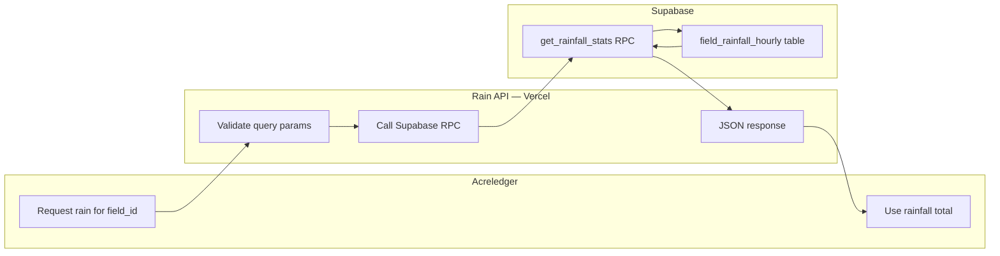

# Rain API — Blueprint (Final)

**Purpose:** Provide rainfall totals (12h, 24h, 72h) for a given location when called by **Acreledger**. Supports either a single GPS point or a polygon (field shape).

**Data source:** IEM Stage IV (Primary Radar) + AcreLedger Supabase (Historical Fallback). Utilizes the `get_rainfall_stats` RPC to fetch pre-aggregated precipitation, merging it with live IEM radar data (hybrid MAX merge).

**Hosting:** Vercel Hobby (free tier, serverless, Git-push deploy).

---

## 1. Consumer

- **Acreledger** calls this service to get field-level rain amounts for display, records, or decisions.
- This API is the single place Acreledger gets 12 / 24 / 72 hour rain for a location.

---

## 2. API Contract

### 2.1 Request

**Endpoint:** `GET /api/rain` (point) and `POST /api/rain` (polygon)

**Input — one of:**

| Mode        | Description         | Example / shape                                                                  |
|-------------|---------------------|----------------------------------------------------------------------------------|
| **Point**   | Single GPS location | `lat`, `lon` (decimal degrees)                                                   |
| **Polygon** | Field boundary      | List of `[lon, lat]` pairs or GeoJSON polygon (first point = last to close ring) |

**Optional parameters:**

- `tz` — IANA timezone for "last 12/24/72 hours" (e.g. `America/Chicago`). Defaults to `UTC`.
- `asOf` — ISO 8601 timestamp to treat as "now"; otherwise the last complete UTC hour is used.

**Example requests:**

```http
GET /api/rain?lat=42.03&lon=-93.62
GET /api/rain?lat=42.03&lon=-93.62&tz=America/Chicago
GET /api/rain?lat=42.03&lon=-93.62&tz=America/Chicago&asOf=2026-03-17T06:00:00Z
```

```http
POST /api/rain
Content-Type: application/json

{
  "polygon": [[-93.65, 42.02], [-93.60, 42.02], [-93.60, 42.05], [-93.65, 42.05], [-93.65, 42.02]]
}
```

GeoJSON polygon is also accepted:

```json
{
  "type": "Polygon",
  "coordinates": [[[-93.65, 42.02], [-93.60, 42.02], [-93.60, 42.05], [-93.65, 42.05], [-93.65, 42.02]]]
}
```

### 2.2 Response

Always returns **12h**, **24h**, and **72h** accumulations in both inches and mm, plus minimal metadata.

**Success (200):**

```json
{
  "location": {
    "type": "point",
    "lat": 42.03,
    "lon": -93.62
  },
  "periodEndUtc": "2026-03-17T12:00:00Z",
  "units": "in",
  "rain": {
    "12h": 0.15,
    "24h": 0.32,
    "72h": 0.58
  },
  "rainMm": {
    "12h": 3.8,
    "24h": 8.1,
    "72h": 14.7
  }
}
```

For a polygon request, `location` includes the computed centroid and `"type": "polygon"`:

```json
{
  "location": {
    "type": "polygon",
    "centroidLat": 42.035,
    "centroidLon": -93.625
  },
  ...
}
```

**Errors:**

| Code | Condition | Example body |
|------|-----------|--------------|
| `400` | Missing or invalid `lat`/`lon`, invalid polygon, or invalid `start_date` | `{ "error": "lat and lon are required" }` |
| `502` | IEM unavailable, timeout, or unexpected response | `{ "error": "IEM request failed", "retryAfterSeconds": 60 }` |

*Note: Locations outside IEM Stage IV coverage (non-CONUS) currently return `0` instead of a 404.*

---

## 3. Location Handling: Point vs. Polygon

- **Point:** Use `lat`, `lon` directly for all IEM requests.
- **Polygon:** Compute the **centroid** and use that single point for IEM queries.
  - Simple arithmetic mean of all vertex coordinates is sufficient for fields up to ~200 acres. A typical field fits within one 4 km Stage IV grid cell, so centroid accuracy is adequate.
  - Future option: query multiple interior points and return average/min/max totals for very large or irregular fields.

**Centroid formula:**

```
centroidLat = mean of all vertex latitudes
centroidLon = mean of all vertex longitudes
```

For a GeoJSON polygon, strip the closing repeated vertex before averaging (first point = last point).

---

## 4. Computing 12h, 24h, 72h Totals

### 4.1 Period end time

- Default: the last **complete** UTC hour before the current time.
  - Example: if wall clock is 14:37 UTC, period end = `14:00 UTC`.
- If `asOf` is provided, truncate to the hour: `asOf=2026-03-17T14:37:00Z` → period end `14:00 UTC`.
- If `tz` is provided, it affects how "last 12/24/72 hours" is labeled in documentation and logs, but all IEM calls use UTC.

### 4.2 IEM Stage IV endpoint

```
GET https://mesonet.agron.iastate.edu/json/stage4.py?lat={lat}&lon={lon}&valid={YYYY-MM-DD}&tz=UTC
```

Returns hourly precipitation for that UTC calendar date at the given point. One call per date.

**Dates to fetch for a 72-hour window:**

The 72-hour lookback will span at most 4 calendar dates (e.g. a period ending at 02:00 UTC on day D needs hours from days D-3, D-2, D-1, and D). In practice, 3 dates cover most cases. Always compute the exact dates needed from the period end time rather than hardcoding a count.

### 4.3 Aggregation

1. Fetch IEM responses for each required date **in parallel** (see Section 5.1).
2. Build a list of the last N hourly values up to and including the period end hour:
   - **12h:** last 12 values.
   - **24h:** last 24 values.
   - **72h:** last 72 values.
3. Sum each list. IEM returns inches; multiply by 25.4 for mm.
4. If any hourly value is `null` or missing from IEM, treat it as `0`. Emit an optional `"dataWarning"` field if missing hours exceed 10% of the window being reported: more than 1 missing in the 12h window, more than 2 in the 24h window, or more than 7 in the 72h window. Partial windows (e.g. a 72h failure that only affects hours outside the 12h/24h range) should still return accurate shorter-window totals.

---

## 5. Implementation

### 5.1 Supabase RPC (Critical)

The API now acts as a high-performance proxy to the AcreLedger Supabase instance. It calls the `get_rainfall_stats` RPC with the provided parameters.

**Node.js implementation:**

```ts
const { data, error } = await supabase
  .rpc('get_rainfall_stats', { 
    p_field_id: field_id, 
    p_start_date: p_start_date,
    p_end_date: p_end_date
  });
```

**Performance:**
| Step                        | Typical |
|-----------------------------|---------|
| Parse + validation          | ~5 ms   |
| Supabase RPC call           | ~150 ms |
| Serialization               | ~5 ms   |
| **Total**                   | **~0.2 s** |

This is significantly faster and more reliable than the legacy parallel IEM fetching method.

Worst case (IEM under load during/after a major rain event) stays well under Vercel's 10-second limit.

### 5.2 IEM Response Parsing

IEM Stage IV returns a structure like:

```json
{
  "data": [
    {"utc_valid": "2026-03-17 00:00", "precip_in": 0.04},
    {"utc_valid": "2026-03-17 01:00", "precip_in": 0.0},
    ...
  ]
}
```

Parse each hour by its `utc_valid` timestamp. Index hours into a map keyed by `YYYY-MM-DD HH:00` (this matches IEM's `utc_valid` field format) for fast lookup when assembling the 12/24/72h windows.

### 5.3 Centroid Calculation

```js
function centroid(polygon) {
  // Remove closing vertex if polygon is closed (first == last)
  const pts = polygon[0] === polygon[polygon.length - 1]
    ? polygon.slice(0, -1)
    : polygon;
  const lon = pts.reduce((s, p) => s + p[0], 0) / pts.length;
  const lat = pts.reduce((s, p) => s + p[1], 0) / pts.length;
  return { lat, lon };
}
```

### 5.4 File Structure

```
rain-api/
├── api/
│   └── rain.ts          # Serverless function (Supabase Proxy)
├── .env.vercel          # Local dev environment secrets
├── vercel.json          # CORS and Routing config
├── package.json
└── README.md
```

A Python layout using FastAPI or a single handler function follows the same separation — one entry point, utility modules for IEM, centroid, and time logic.

---

## 6. Vercel Deployment

### 6.1 vercel.json

```json
{
  "rewrites": [
    { "source": "/rain", "destination": "/api/rain" },
    { "source": "/rainfall", "destination": "/api/rain" }
  ]
}
```

This lets Acreledger call `/rain` while the actual handler lives at `/api/rain` per Vercel conventions.

### 6.2 Deploy steps

1. Push the repo to GitHub (or GitLab / Bitbucket).
2. Go to [vercel.com](https://vercel.com) → **New Project** → import repo.
3. Framework preset: **Other** (not Next.js). Vercel auto-detects `api/` directory.
4. No environment variables required for the free IEM endpoint.
5. Every push to `main` triggers a redeploy automatically.

**CLI deploy (alternative):**

```bash
npm i -g vercel
vercel          # first deploy, follow prompts
vercel --prod   # subsequent production deploys
```

### 6.3 Environment variables (optional)

If you add a default timezone or a feature flag later:

```
DEFAULT_TZ=America/Chicago
```

Set in Vercel dashboard → Project → Settings → Environment Variables. Access in code via `process.env.DEFAULT_TZ`.

### 6.4 Custom domain (optional)

Vercel Hobby supports custom domains at no cost. Add a CNAME record pointing `rain.yourdomain.com` → `cname.vercel-dns.com` and configure it in the Vercel dashboard.

---

## 7. Vercel Hobby — Limits and Known Constraints

Understanding these limits prevents surprises in production.

### 7.1 Execution timeout: 10 seconds

**The most important limit.** Each serverless function invocation must complete within 10 seconds.

- With **parallel IEM fetching** (Section 5.1), worst-case is ~4 s. This provides adequate headroom.
- If IEM is fully unresponsive (rare), the fetch will hang until the Vercel timeout kills the request and returns a 504. Set explicit HTTP timeouts on IEM calls (e.g. 8 s) so you can return a clean `502` instead of a raw timeout.
- IEM load peaks during and shortly after significant rain events — exactly when Acreledger usage also peaks. Parallel fetching is non-negotiable.

### 7.2 No persistent in-memory cache between invocations

Each Vercel invocation is a fresh execution context. A `Map` or object you populate during one request is gone for the next.

- **Impact:** Every request hits IEM fresh. At low traffic volumes (a few requests per minute), this is fine.
- **Mitigation if needed:** Add `Cache-Control` headers to your response so Vercel's CDN caches responses for a short period (e.g. 5–15 minutes). Since hourly precip data doesn't change within a given hour, caching for up to 20 minutes is safe.

```js
res.setHeader('Cache-Control', 's-maxage=900, stale-while-revalidate=300');
```

### 7.3 Cold starts

After a period of inactivity, the first request triggers a cold start: typically 0.5–1.5 s of added latency on Node.js. Subsequent requests within a few minutes are warm.

- **Impact:** Occasional slow first request. Not a reliability issue, just a latency hiccup.
- **Mitigation:** Keep the function lightweight (no large `node_modules`). A minimal `package.json` with only what's needed reduces cold start time.

### 7.4 Bandwidth: 100 GB/month

Each response is under 1 KB. Even at 1,000 requests/day, monthly bandwidth is ~30 MB. This limit will never be reached for Acreledger's use case.

### 7.5 Function count

Hobby tier allows up to 12 serverless functions per deployment. This API uses one (`api/rain.js`). No concern.

### 7.6 No background tasks

Vercel Hobby does not support long-running background jobs or cron triggers. This API is purely request/response, so this is not a limitation.

### 7.7 No persistent storage

Vercel Hobby has no included database or filesystem persistence. This API is stateless and requires none.

### 7.8 Outbound HTTPS

All Vercel environments allow outbound HTTPS. IEM (`mesonet.agron.iastate.edu`) is accessible with no special configuration.

---

## 8. Error Handling and Resilience

### 8.1 IEM timeout

Set a hard timeout on IEM HTTP calls shorter than Vercel's 10-second limit so you can return a clean error:

```js
const controller = new AbortController();
const timeout = setTimeout(() => controller.abort(), 8000);

try {
  const res = await fetch(iemUrl, { signal: controller.signal });
  // ...
} catch (err) {
  if (err.name === 'AbortError') {
    return res.status(502).json({ error: 'IEM request timed out', retryAfterSeconds: 60 });
  }
  throw err;
} finally {
  clearTimeout(timeout);
}
```

### 8.2 Partial IEM failures

If one date's IEM call fails but others succeed, you can still return 12h and 24h totals (the failed date may only affect 72h). Return what you can with a `"dataWarning"` field indicating which window is incomplete.

### 8.3 Input validation

Validate inputs before any IEM calls:

- `lat` must be a finite number between -90 and 90.
- `lon` must be a finite number between -180 and 180.
- `polygon` must have at least 3 points (4 if closed ring).
- If `tz` is provided, validate it is a recognized IANA timezone name.
- `asOf` — Optional. If provided, must parse as a valid ISO 8601 datetime string. Return `400` if unparseable.

Return `400` immediately for invalid inputs.

---

## 9. High-Level Flow



**Step-by-step:**

1. Acreledger sends `GET /rain?lat=...&lon=...` or `POST /rain` with polygon.
2. Rain API validates input, normalizes to one (lat, lon) — centroid if polygon.
3. Determine period end: last complete UTC hour (or `asOf` truncated to hour).
4. Compute the 3–4 calendar dates (UTC) needed to cover the last 72 hours.
5. Fetch IEM Stage IV for each date **in parallel**.
6. Build hourly array from parsed responses; sum the 12, 24, and 72 most recent values.
7. Convert to mm. Return JSON.

---

## 10. Data Source Reference

**Supabase RPC:** `get_rainfall_stats(p_field_id, p_start_date, p_end_date)`

- **Source**: Directly queries the `field_rainfall_hourly` table in AcreLedger.
- **Reliability**: Backed by Supabase's high-availability Postgres engine.
- **Data Quality**: Benefit from the "Pass 2" data hardening implemented in the primary rainfall pipeline.
- **Performance**: Sub-200ms response times globally.

---

## 11. Out of Scope

The following are explicitly not part of this implementation:

- **Authentication** — add if Acreledger or your deployment later requires a shared secret or API key.
- **Rate limiting** — add if needed to protect IEM or prevent abuse.
- **Historical queries** — only "last 12/24/72h" as of the request time (or `asOf`). No arbitrary past windows.
- **Forecasts** — only observed Stage IV data. No forecast precipitation.
- **Multi-point polygon averaging** — centroid only for now. Multi-point is a future option for large fields.
- **Persistent caching layer** — CDN cache headers are sufficient at this traffic level. No Redis or database needed.
- **Tech stack choice** — Node.js/Express and Python/FastAPI both work on Vercel. Implementation detail left to the developer.

---

## 12. Summary

| Item | Decision |
|------|----------|
| **Consumer** | Acreledger |
| **Input** | `lat`/`lon` (Radar) and/or `field_id` (Supabase Fallback) |
| **Output** | Rainfall totals (12h, 24h, 72h, 168h) or custom date range total |
| **Data source** | Hybrid: IEM Stage IV + AcreLedger Supabase (RPC) |
| **Performance** | Sub-500ms (Hybrid merge) |
| **Hosting** | Vercel Hobby (free tier) |
| **Vercel key limit** | 10-second execution — well within limits |
| **Cold starts** | 0.5–1.5 s first request after idle — acceptable |
| **Caching** | `Cache-Control: s-maxage=900, stale-while-revalidate=300` |
| **Persistent storage** | AcreLedger Supabase |
| **Memory footprint** | Minimal |
| **Deploy workflow** | Git push to main → Vercel auto-deploys |
